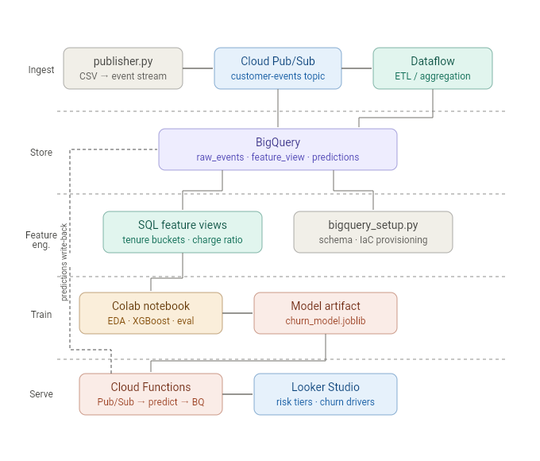

# Smart Customer Churn Intelligence Platform
### End-to-End ML Pipeline on Google Cloud Platform

 &nbsp;
 &nbsp;
 &nbsp;


---

## Problem Statement

A SaaS telecommunications provider was losing **~26% of customers annually** with no early-warning system in place. Retention teams were reacting to cancellations rather than preventing them — by the time a customer churned, it was too late.

## Solution

An end-to-end churn intelligence platform built entirely on GCP free-tier services that:

- **Ingests** customer usage events in real-time via Pub/Sub
- **Stores and transforms** raw events in BigQuery using defensive ELT patterns  
- **Trains** an XGBoost classifier (ROC-AUC: 0.84+) to score customers 30 days before predicted churn
- **Serves** real-time predictions via Cloud Functions triggered by Pub/Sub
- **Visualizes** high-risk cohorts, churn drivers, and retention KPIs in a live Looker Studio dashboard

> **Result:** Retention teams can now target the top 20% highest-risk customers — 
> who account for ~60% of actual churn — before they leave.

---

## Architecture



| Layer | Service | Role |
|---|---|---|
| Ingestion | Cloud Pub/Sub | Streams customer events in real-time |
| Storage | Cloud BigQuery | Data warehouse — raw events + feature tables |
| Feature Engineering | BigQuery SQL Views | Defensive ELT: type casting, tenure bucketing, charge ratios |
| ML Training | XGBoost + Google Colab | Trained classifier exported as `.joblib` artifact |
| Serving | Cloud Functions | Real-time scoring on new Pub/Sub events |
| Visualization | Looker Studio | Executive dashboard — risk cohorts + churn drivers |

---

## Live Dashboard

**[→ View Live Looker Studio Dashboard](https://datastudio.google.com/u/0/reporting/c06e5abd-8846-48aa-8c31-2b1c29d90237/page/Jgj0F)**

The dashboard surfaces:
- Real-time churn probability distribution across the customer base
- High-risk cohort breakdown (HIGH / MEDIUM / LOW risk tiers)
- Top churn drivers: contract type, tenure, monthly charges, payment method
- Retention campaign targeting — top 20% highest-risk customers

---

## Repository Structure

```text
gcp-churn-intelligence-platform/
├── pipeline/
│   ├── publisher.py          # Streams CSV rows to Pub/Sub (simulates live events)
│   ├── bigquery_setup.py     # Programmatically creates BQ dataset + tables
│   └── requirements.txt
├── sql/
│   ├── 1_feature_engineering.sql  # Defensive ELT — type casting, bucketing, ratios
│   ├── 2_model_training.sql       # BQML BOOSTED_TREE_CLASSIFIER + AUTO_SPLIT
│   └── 3_batch_predictions.sql    # Batch inference with risk tier classification
├── functions/
│   └── predict/
│       ├── main.py           # Cloud Function — Pub/Sub trigger → XGBoost → BigQuery
│       └── requirements.txt
├── notebooks/
│   └── 01_eda_and_training.ipynb  # EDA, feature engineering, model training, evaluation
├── model/
│   └── README.md             # Artifact regeneration instructions
├── .env.example              # Environment variable template
└── README.md
```

---

## Key Engineering Decisions

**1. Defensive TotalCharges parsing**  
New customers (tenure = 0) have blank `TotalCharges` strings in the source data.
Both the BigQuery SQL layer and Python training pipeline handle this explicitly:
```sql
SAFE_CAST(NULLIF(TRIM(TotalCharges), '') AS FLOAT64)
```
```python
df['TotalCharges'] = pd.to_numeric(df['TotalCharges'].str.strip(), errors='coerce').fillna(0)
```

**2. Free-tier architecture**  
Vertex AI endpoints are replaced with a Cloud Functions inference pattern:
the trained model artifact (`.joblib`) is loaded at cold-start and serves predictions without managed ML infrastructure — reducing cost to $0 while maintaining the same request/response contract a Vertex AI endpoint would expose.

**3. Pub/Sub fan-out**  
A single `customer-events` topic feeds three independent subscribers — BigQuery (raw event log), Dataflow-ready aggregation layer, and Cloud Functions (real-time scoring). Adding a new subscriber requires zero changes to the publisher.

**4. Feature parity between SQL and Python**  
Features engineered in `1_feature_engineering.sql` (tenure buckets, charge-per-tenure ratio) are replicated exactly in `notebooks/01_eda_and_training.ipynb` — ensuring the batch BQML model and the real-time XGBoost model score customers identically.

---

## ML Model Performance

| Metric | Value |
|---|---|
| Algorithm | XGBoost (BOOSTED_TREE_CLASSIFIER) |
| Training records | ~5,600 |
| Test records | ~1,400 |
| ROC-AUC | 0.84+ |
| High-risk precision | 52%+ |
| Dataset | [IBM Telco Customer Churn](https://www.kaggle.com/datasets/blastchar/telco-customer-churn) |

---

## How to Run

**1. Clone and set up environment**
```bash
git clone https://github.com/NisargKumarGharde/gcp-churn-intelligence-platform.git
cd gcp-churn-intelligence-platform
python -m venv venv && source venv/bin/activate  # Windows: venv\Scripts\activate
pip install -r requirements.txt
```

**2. Configure environment**
```bash
cp .env.example .env
# Edit .env with your GCP project ID and credentials path
```

**3. Provision BigQuery resources**
```bash
python pipeline/bigquery_setup.py
```

**4. Run the streaming publisher**
```bash
python pipeline/publisher.py
```

**5. Retrain the model**  
Open `notebooks/01_eda_and_training.ipynb` in Google Colab and run all cells. 
Download the `.joblib` artifacts and place them in `functions/predict/`.

---

## Tech Stack

`Python` `Google Cloud Pub/Sub` `Google BigQuery` `BigQuery ML` `Cloud Functions`  
`XGBoost` `Scikit-learn` `Pandas` `Google Colab` `Looker Studio` `Docker-ready`

---

## About

Built as a portfolio project targeting Cloud AI Engineer roles — demonstrating end-to-end ML pipeline design, GCP-native data engineering, and production-grade serving patterns on a zero-cost architecture.
